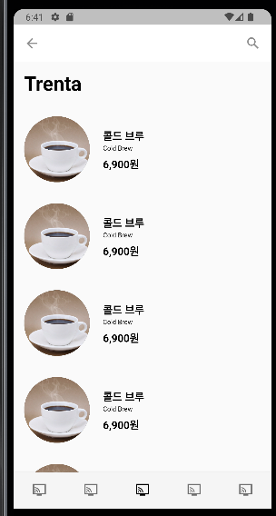
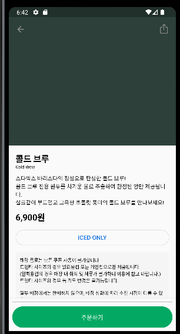
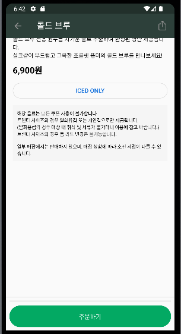

# 플러터 스타벅스 Mock 데이터로 화면 완성

## 1. 미리보기

## 2. 기능
- Repository를 Future.Delayed 로 생성함.
- mock 패키지를 생성하여 가짜 데이터 만듬
- LayoutBuilder 사용해서 AppBar Title Fade in, out 효과 만듬
- persistentFooterButtons을 이용해서 Scroll이 되는 화면에 고정 하단 버튼 만듬.
- MVVM 패턴으로 데이터 바인딩함

## 3. 서버 완성되면 연결만 하면 끝